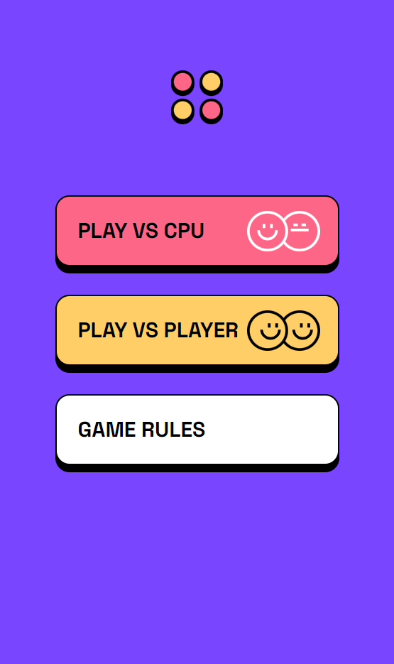

# Connect Four Game

### Description

Connect four of your checkers in a row while preventing your opponent from doing the same.

[Live demo](https://arthur199212.github.io/connect-four-game/)

### Features

- [x] Play a game with AI ([negamax algorithm](https://en.wikipedia.org/wiki/Negamax))
- [x] Play a game with another human player
- [x] Menu, Game, Rules screens (mobile layout)
- [x] Show winning combination
- [x] Limit time on each turn
- [x] Win, lose, stalemate game conditions

### Technologies

- TypeScript
- React
- React router
- TailwindCSS
- Parcel

### Screenshots

